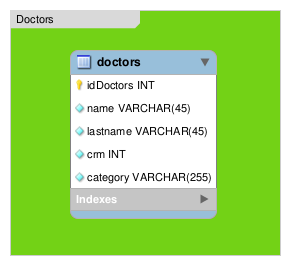

# MSDoc-Challenge

Desafio Técnico para Fullstack Developer

# Executando com o Docker

Você deve ter o [Docker](https://docs.docker.com/install/) e o [Docker Compose](https://docs.docker.com/compose/install/) instalados.

Primeiro, crie um diretório chamado **data** na pasta **docker** na raiz do projeto:

```bash
$ mkdir -p docker/data
```

Na pasta do projeto raiz, crie a imagem e inicie o docker:

```bash
$ docker-compose up -d --build
```

Abra seu navegador para [http://localhost:8080/](http://localhost:8080/) e você deverá ver o sistema.

Para encerrar o docker, rode o seguinte comando:

```bash
$ docker-compose stop
```

## Modelo do Banco de Dados

O modelo é como uma 'planta' que apresenta a representação das entidades que compõe o banco de dados com suas propriedades, relacionamentos, restrições, etc.



## Estrutura de diretórios

.<br/>
|&nbsp;&nbsp;&#822; application<br/>
&nbsp;&nbsp;&nbsp;&nbsp;&nbsp;|&nbsp;&#863;&nbsp;&nbsp;cache <sup>777 permission</sup><br/>
&nbsp;&nbsp;&nbsp;&nbsp;&nbsp;|&nbsp;&#863;&nbsp;&nbsp;config<br/>
&nbsp;&nbsp;&nbsp;&nbsp;&nbsp;|&nbsp;&#863;&nbsp;&nbsp;controllers<br/>
&nbsp;&nbsp;&nbsp;&nbsp;&nbsp;|&nbsp;&#863;&nbsp;&nbsp;core<br/>
&nbsp;&nbsp;&nbsp;&nbsp;&nbsp;|&nbsp;&#863;&nbsp;&nbsp;helpers<br/>
&nbsp;&nbsp;&nbsp;&nbsp;&nbsp;|&nbsp;&#863;&nbsp;&nbsp;hooks<br/>
&nbsp;&nbsp;&nbsp;&nbsp;&nbsp;|&nbsp;&#863;&nbsp;&nbsp;language<br/>
&nbsp;&nbsp;&nbsp;&nbsp;&nbsp;|&nbsp;&#863;&nbsp;&nbsp;libraries<br/>
&nbsp;&nbsp;&nbsp;&nbsp;&nbsp;|&nbsp;&#863;&nbsp;&nbsp;logs<br/>
&nbsp;&nbsp;&nbsp;&nbsp;&nbsp;|&nbsp;&#863;&nbsp;&nbsp;models<br/>
&nbsp;&nbsp;&nbsp;&nbsp;&nbsp;|&nbsp;&#863;&nbsp;&nbsp;third_party<br/>
&nbsp;&nbsp;&nbsp;&nbsp;&nbsp;|&nbsp;&#863;&nbsp;&nbsp;views<br/>
|&nbsp;&nbsp;&#822; codeigniter<br/>
|&nbsp;&nbsp;&#822; .htaccess<br/>
|&nbsp;&nbsp;&#822; index.php<br/>

# Configurações

Os arquivos que deve-se mudar para o sistema ser configurado no servidor são:

- [database.php](https://github.com/MlocksDev/msdoc-challenge/blob/main/application/config/database.php)

```php
$db['default'] = array(
	'dsn'	=> '',
	'hostname' => '', // Local database hostname
	'username' => '', // Local database root
	'password' => '', // Local database password
	'database' => '', // Local database name
	'dbdriver' => 'mysqli',
	'dbprefix' => '',
	'pconnect' => FALSE,
	'db_debug' => (ENVIRONMENT !== 'production'),
	'cache_on' => FALSE,
	'cachedir' => '',
	'char_set' => 'utf8',
	'dbcollat' => 'utf8_general_ci',
	'swap_pre' => '',
	'encrypt' => FALSE,
	'compress' => FALSE,
	'stricton' => FALSE,
	'failover' => array(),
	'save_queries' => TRUE
);
```

- [.htaccess](https://github.com/MlocksDev/msdoc-challenge/blob/main/.htaccess)

```apacheconf
RewriteEngine on
SetEnvIf Authorization .+ HTTP_AUTHORIZATION=$0
RewriteCond %{REQUEST_FILENAME} !-f
RewriteCond %{REQUEST_FILENAME} !-d
RewriteCond $1 !^(index\.php|images|css|javascript|rte|robots\.txt)
RewriteRule ^(.*)$ index.php?$1 [L,QSA]
```

## Requisitos do Servidor Web

Recomenda-se o PHP versão 5.6 ou mais recente, MySQL 5.6 ou mais recente e servidor web Apache (com _mod_rewrite_ habilitado).

Também deve funcionar no 5.3.7, mas recomendamos que você NÃO execute versões antigas do PHP, por causa da segurança e desempenho em potencial problemas, bem como recursos ausentes.

## CodeIgniter

Clique em [Codeigniter](codeigniter.rst) para mais informações sobre a framework MVC utilizada.

# Referências

- [Apache HTTP server](https://httpd.apache.org/)
- [PHP Reference Manual](https://www.php.net/)
- [MySQL 5.6 Reference Manual](https://dev.mysql.com/doc/refman/5.6/en/)
- [mysql - Docker Hub](https://hub.docker.com/_/mysql)
- [mysql - Docker Documentation](https://docs.docker.com/samples/library/mysql/)
- [PhpFastCache - A PHP library made for building reactive apps](https://www.phpfastcache.com/)
- [Sufee Admin - HTML5 Admin Template](https://colorlib.com/polygon/sufee/)
